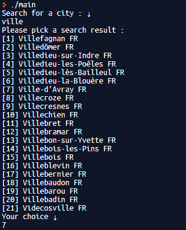
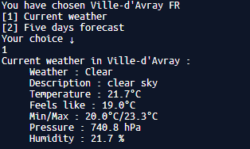
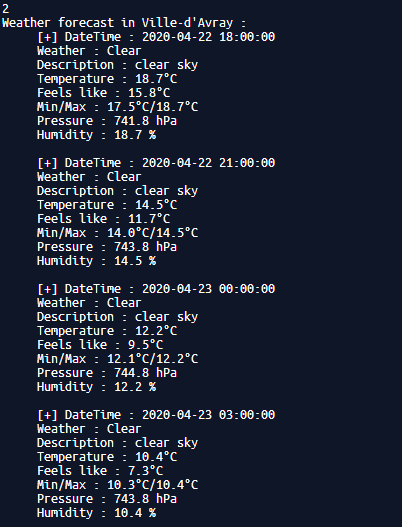
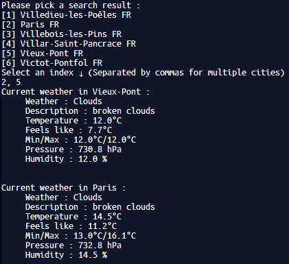

# iOS Weather App #

This is a simple weather app made for educational purposes by a Sorbonne University undergraduate student (L3 DANT).  
Supervised by [Adrien Humilière](mailto:adhumi+dant@gmail.com).

## Features ##

* Searching  a city  

* Choosing a city and getting the current weather  

* Getting a forecast on the next five days  

* Added multiple city support for current weather  

## Misc ##

* For now, we can use the app via command prompt, UI isn't done yet.

## Author ##
> [Massil Taguemout](mailto:massitaguemout@gmail.com)  
> Licence Info DANT  
> [Sorbonne University](http://www.sorbonne-universite.fr/)