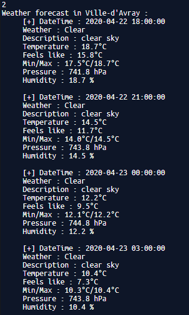

# iOS Weather App #

This is a simple weather app made for educational purposes by a Sorbonne University undergraduate student (L3 DANT).  
Supervised by [Adrien Humilière](mailto:adhumi+dant@gmail.com).

## Presentation ##
This project uses the [OpenWeatherMap API](https://openweathermap.org/api), which provides two endpoints that we
will use in this app :
* [Current weather data](https://openweathermap.org/current) for getting current weather in a location.
* [Five days forecast](https://openweathermap.org/forecast5) for getting a five-day forecast in a location.

## Features ##

* Searching a city  

* Choosing a city and getting the current weather  

* Getting a forecast on the next five days  

* Added multiple city support for current weather  

## To do list ##

- [x] Searching a city in JSON data
- [x] Getting current weather for a city
- [x] Getting current weather for a list of cities
- [x] Getting a five-day forecast for a city
- [ ] User interface

## Author ##
[Massil Taguemout](mailto:massitaguemout@gmail.com)  
Licence Info DANT  
[Sorbonne University](http://www.sorbonne-universite.fr/)